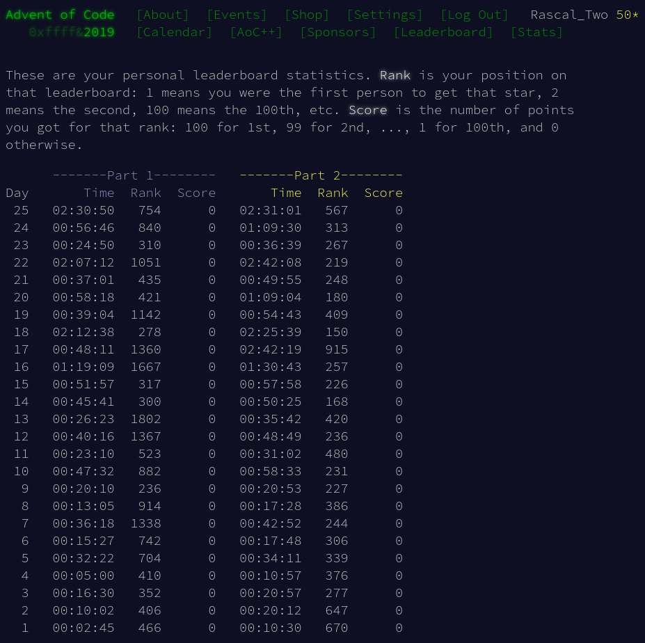
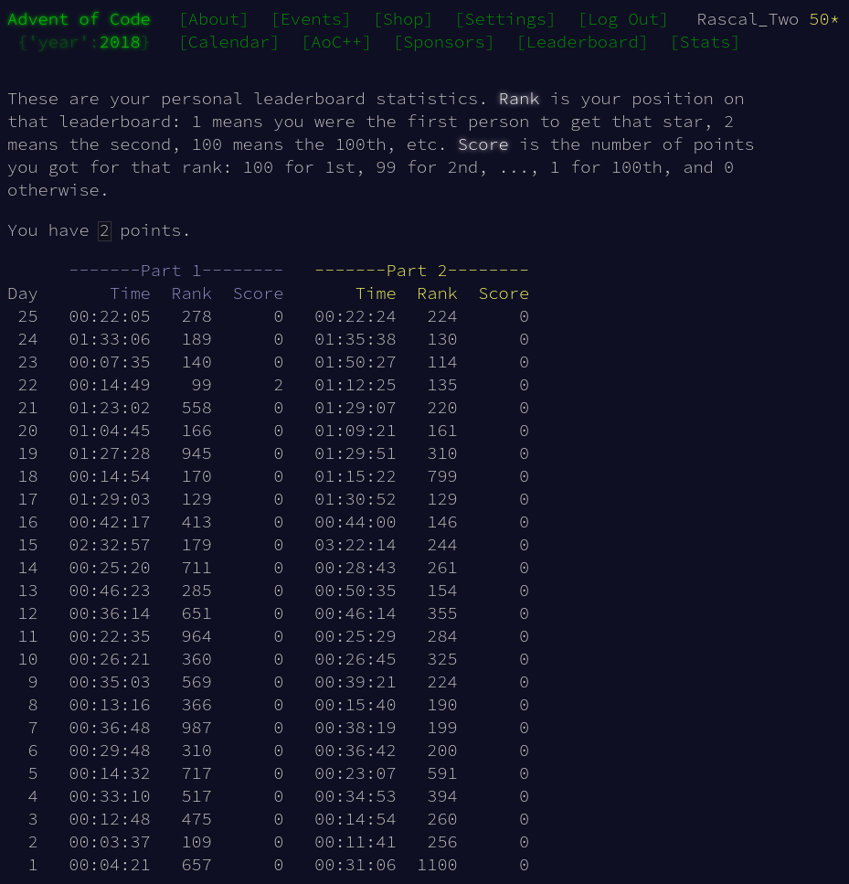

# Advent Of Code

Here is my code for Advent of Code

## Table of Contents

- [Advent Of Code](#advent-of-code)
  - [Table of Contents](#table-of-contents)
  - [Placements](#placements)
  - [2022](#2022)
    - [Visualizations](#visualizations)

## Placements

|                2021                |                2020                |                2019                |                2018                |                2017                |
| :--------------------------------: | :--------------------------------: | :--------------------------------: | :--------------------------------: | :--------------------------------: |
|  |  |  |  |  |

## 2022

### Visualizations

  
Day #01 (D3.js)

  https://user-images.githubusercontent.com/9403665/206322850-f0fa8c6c-fe15-4528-a3ee-e59baa33a7ef.mp4

  
Day #03 (Terminal)

  https://github.com/RascalTwo/AdventOfCode/assets/9403665/7361c923-4aa9-4547-95cd-889abb36410e

